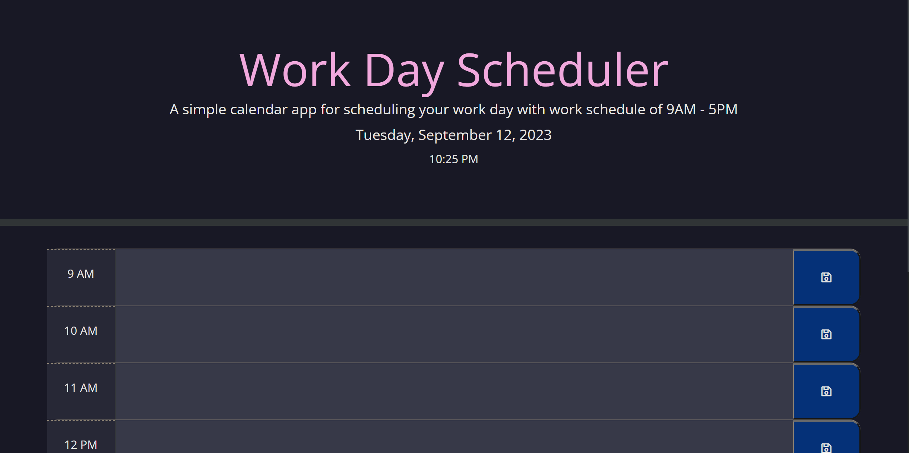
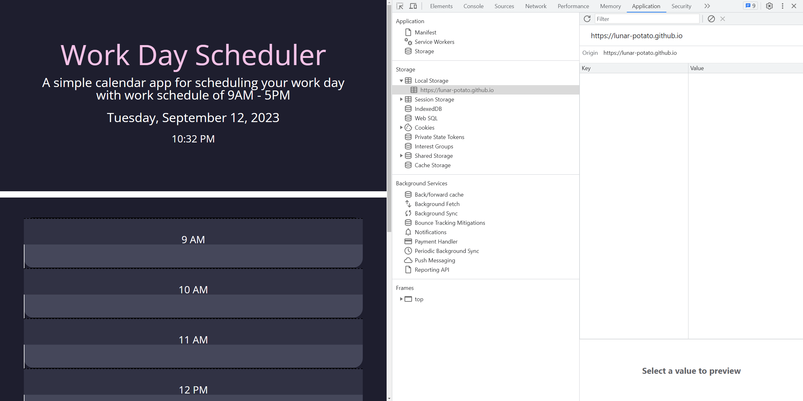

# Daily Planner App for Work
This is a simple calendar app for scheduling your work day.

## Table of Contents
- [Introduction](#introduction)
- [Features](#features)
- [Technologies](#technologies)
- [Getting Started](#getting-started)
- [Usage](#usage)
- [Theme](#theme)
- [License](#license)

## Introduction
Daily Planner App for Work is a web-based application that allows you to plan and organize your work day. This app provides a visual representation of your day, broken down into hourly work time blocks which you can add, edit, and save tasks or notes for each hour, ensuring that you stay on top of your schedule. Ensuring that you are ahead of the game.

## Features
- Standard business hours timeblocks from 9 AM to 5 PM.
- Color-coded time blocks to indicate the past, the present, and the future hours.
- Easy task of input and saving with notifaction of where it has been saved.
- Local storage for saving and retrieving your tasks.
- Responsive design for multiple devices.

## Technologies
To create this app, I have used 
- HTML (web structure)
- CSS (design)
- JavaScript (Functionality)
- jQuery
- [Bootstrap](https://getbootstrap.com/) (CSS Framework)
- [Font Awesome](https://fontawesome.com/) (Icons)
- [Day.js](https://day.js.org/) (Date and time library)

## Getting Started
To get started, you can use this deployed link to immediately take you to the web app -> https://lunar-potato.github.io/daily-planner-app/

This is how the web app looks like:

## Usage
1. Upon opening the planner app, you will see a small description and the current date and time displayed at the top of the page.

2. The scheduler displays hourly time blocks of standard business hours of 9 AM to 5 PM. Each time block contains a text area for entering tasks, events, or notes and a save button.

3. Time blocks are color-coded:
- Past hours are gray.
- Present hour (current) is red.
- Future hours are green.

4. To add a task for a specific hour, simply head on to the text area, enter your content, then clicking the "Save" button on the right. This will then be saved to your local storage area.

5. To retrieve a previously saved task, simply open the scheduler, and your tasks will be loaded automatically from the local storage.

### To see local storage...
1. Head to your web devtools which to either right click the page then hit inspect or use F12 on windows

2. There will be a small window that would open on the right side of your web and on top bar, you will then head to **Application** then you will see local storage.

## Theme

This project uses **"Catppuccin"** theme for its dark theme styling. The theme provides a calm, cozy, and eazy on the eyes to enhance user experience. Credit goes to Catppuccin Theme

- Theme name: 🌿 Mocha
- Theme Source: [Catppuccin Theme](https://github.com/catppuccin)

Feel free to explore Catppuccin for more customization options and additional details.

## License 
This project is licensed under the MIT License - see the [LICENSE](https://github.com/lunar-potato/daily-planner-app/blob/main/LICENSE) file for more details.
